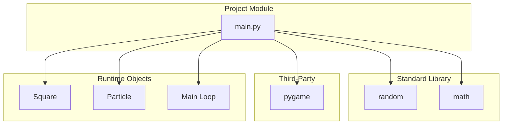
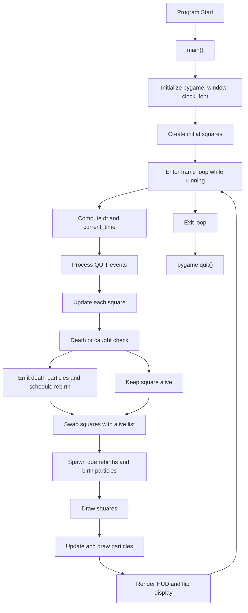
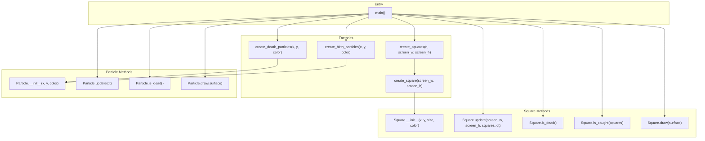
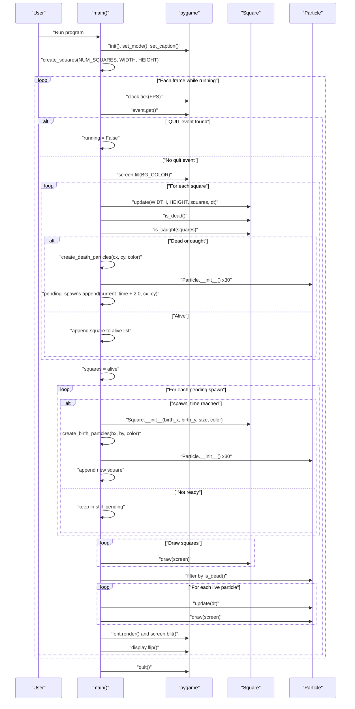

# Project Architecture

This document describes the architecture of the Pygame square simulation implemented in `main.py`.

## Scope

- Single Python module: `main.py`
- Main runtime loop driven by Pygame
- Two domain entities: `Square` and `Particle`
- Factory helpers for square creation and particle effects

## 1) Dependency Graph (Modules)

## 2) High-Level Runtime Flow

## 3) Function-Level Call Graph

## 4) Primary Execution Sequence (Full Frame Path)

## Notes

- The project is intentionally centralized in one module (`main.py`), so coupling between game loop and entity logic is direct.
- Lifecycles are time-driven (`dt` and `current_time`) for frame-rate independent behavior.
- Rebirth is event-scheduled through `pending_spawns`, separated from immediate death handling.

## Assumptions

- The primary execution path is the `main()` loop in `main.py`.
- README currently mentions 20 squares, while code constant `NUM_SQUARES` is 15; diagrams reflect the code path, not README text.
